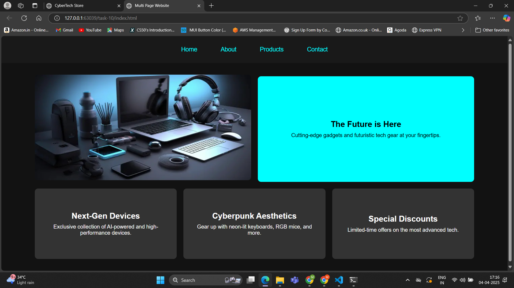
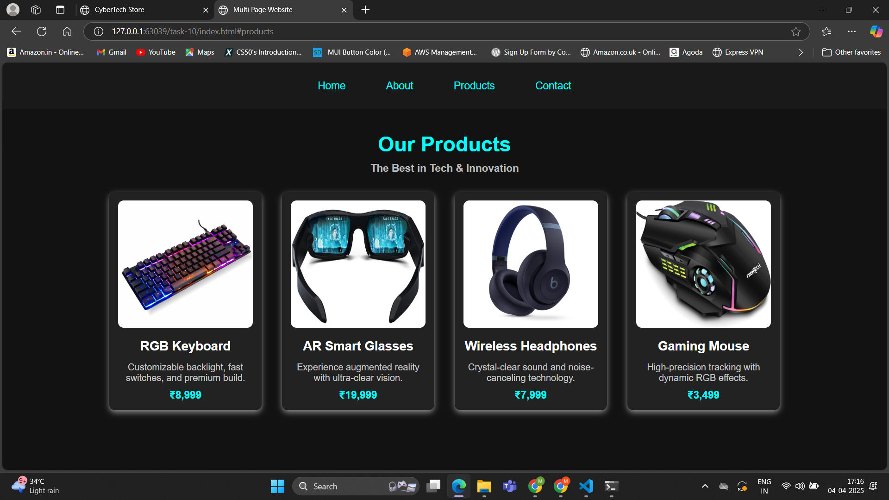
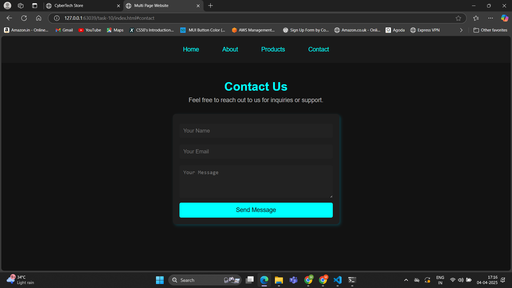

# Task 10 **Interactive Multi-Page Website Simulator with CSS Only**

## **Objective:** 
- Create a fully functional, multi-section website that simulates the experience of navigating between different pages—all without any JavaScript.

## **Requirements:**
- Use the `:target` pseudo-class to display and hide different “pages” or sections of content.
- Incorporate CSS animations and transitions to simulate page transitions (such as fading or sliding effects).
- Design an accessible navigation menu that works across different devices and screen sizes.
- Ensure that the entire experience is responsive and leverages advanced CSS techniques (e.g., combining Flexbox, Grid, and pseudo-classes) to manage layout and state transitions.

## **Implementation:**

1. **CSS-Only Navigation with :target Pseudo-Class**
- Each section (Home, About, Products, Contact) is styled as a separate "page."
- The `:target` pseudo-class is used to display the selected section while hiding the others.
- If no section is targeted, the homepage is shown by default using `body:not(:has(:target)) #home`.

2. **Smooth Page Transitions with CSS Animations:**
- Applied opacity, visibility, and scale transformations to create a fading and zooming effect when switching between sections.
- Used transition properties to make the changes smooth.

3. **Responsive and Accessible Navigation:**
- The navigation bar is designed using Flexbox for proper alignment and spacing.
- A sticky navigation bar ensures that users can switch sections anytime.

4. **Advanced CSS Layout Techniques:**
- Used CSS Grid & Flexbox for structured layout and content organization.
- Ensured that content scales well on different screen sizes using `media queries`.

## **Outputs:**

##### Home:

##### About:

##### Products:

##### Contact:
