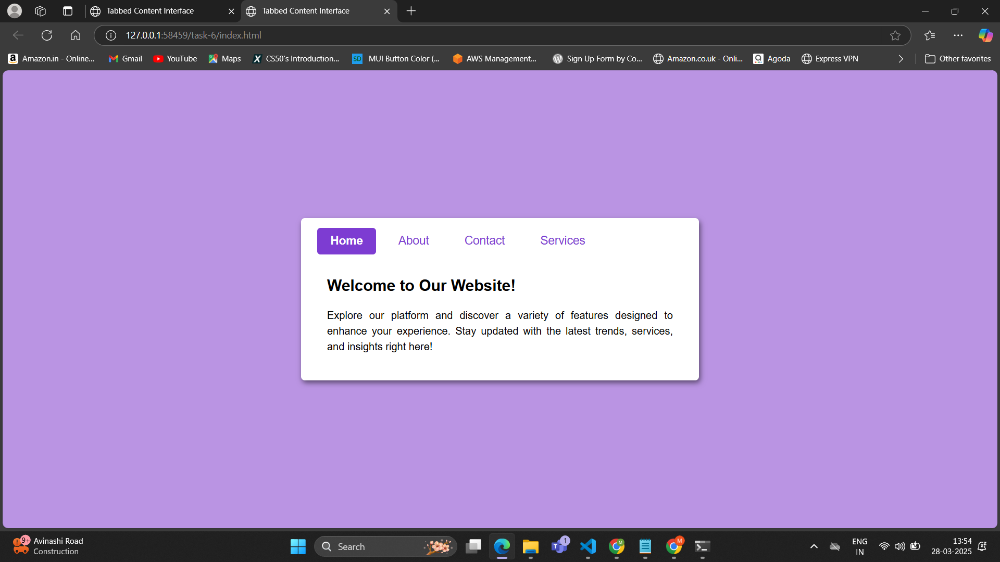
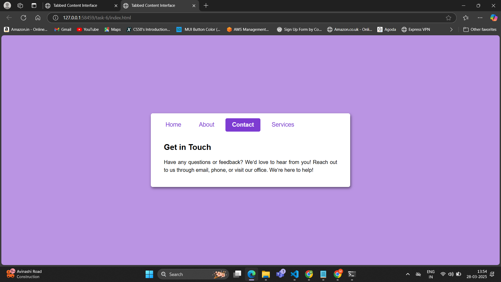

# Tsk-6 **Tabbed Content Interface**

## **Objective:**
Create a tabbed interface where clicking on a tab displays different content sections.

## **Features:**
- Uses radio buttons (hidden) and labels as tabs.
- Utilizes the `:checked` pseudo-class to control tab selection.
- Smooth transition effects when switching between tabs.

## **How It Works:**
1. Each tab is represented by a radio button and a corresponding label.
2. Content sections are wrapped inside a container, each associated with a tab.
3. Initially, all content sections have `display: none;` to keep them hidden.
4. Clicking a label selects the associated radio button.
5. The `:checked` pseudo-class is used with the general sibling selector `~` to set `display: block;` for the corresponding content section, making it visible.
6. Smooth transitions enhance user experience when switching tabs.

## **Outputs:**

- Initially the home is checked

- When another tab is selected, its corresponding content is displayed while hiding the previous one.
