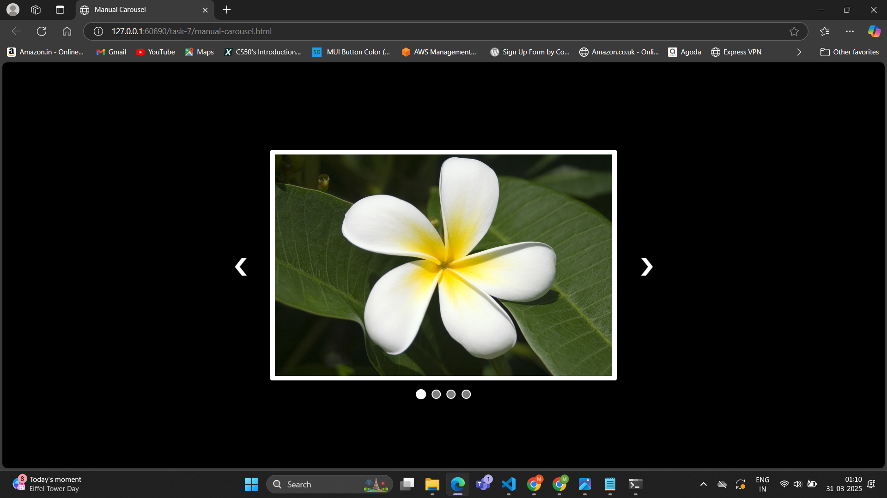
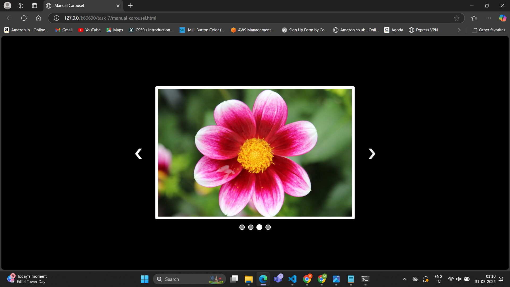

# Task 7 **Pure CSS Carousel/Slider**

## **Objective:** 
- Develop an image carousel that cycles through slides automatically and/or manually.

## **Requirements:**
- Use CSS animations (`@keyframes`) to create an auto-sliding effect.
- Implement manual slide selection using the `:checked` pseudo-class with hidden radio buttons or the `:target` pseudo-class.
- Ensure that the slider is responsive and visually engaging.

## **Implementation:**

#### **Auto-Sliding:**
- Uses CSS animations, `@keyframes slide` to shift .slides at timed intervals, creating a continuous cycle.
- The `translateX` property moves the images left, ensuring a smooth transition.
- The animation loops infinitely, allowing images to change automatically without user interaction.

#### **Manual-Sliding:**
- Hidden radio inputs `<input type="radio">` track the active slide.
- Labels `<label for="slideX">` allow users to select a slide by checking the corresponding radio button.
- By default, all images have `visibility: hidden`, except the one linked to the checked radio button.
- When a radio button is checked via label click, the `:checked` pseudo-class sets `visibility: visible` and `opacity: 1`, displaying the selected image.
- Dots (.controls label) let users select a slide manually.
- Arrows (.arrows label) allow switching between previous and next slides.

## **Outputs:**

#### Carousel with auto sliding:

#### Carousel with manual sliding:

