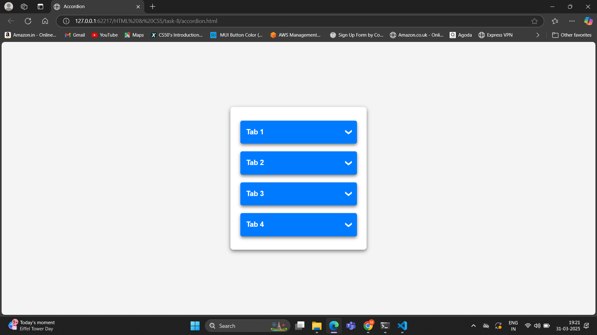
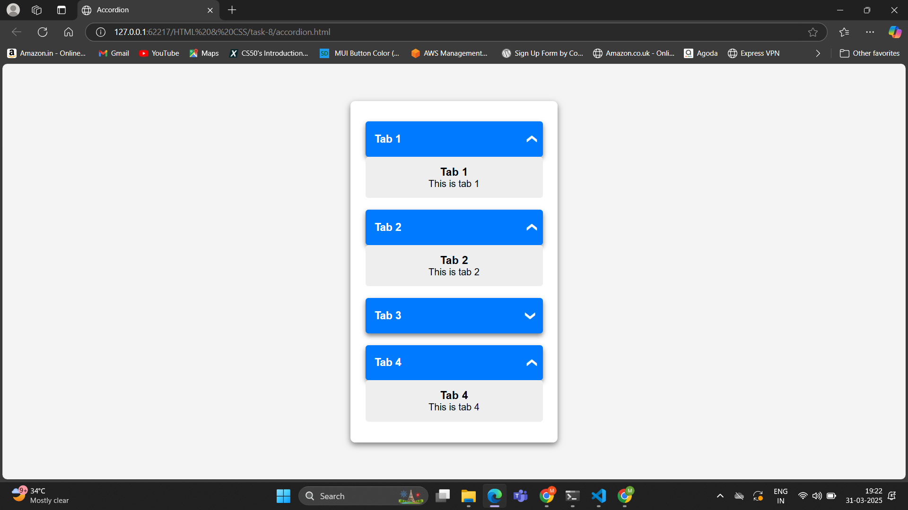

# Task 8 **CSS Accordion Component**

## **Objective:** 
- Build an accordion where content sections expand and collapse on click.

## **Requirements:**
- Use the checkbox hack (a hidden checkbox input with a label) or the `:target` pseudo-class to control the open/closed state of each section.
- Apply CSS transitions to animate the expansion and collapse of content areas.
- Allow multiple sections to be open simultaneously (if desired) or restrict it to one open section at a time.

## **Implementation:**
- Each tab has a hidden `<input type="checkbox">` that tracks its open/closed state.
- The `<label>` acts as a toggle for the checkbox.
- The `:checked` pseudo-class triggers when the checkbox is clicked, controlling the visibility of .tab-content.
- Initially, .tab-content is set to `display: none`
- When checked, , :checked applies `display: block`, making the content visible.
- Multiple sections can be open at once.
- The arrow initially points downward (▼) and rotates upward (▲) when checked
- A transition effect ensures smooth expansion.

## **Outputs:**

#### Accordion:

#### Accordion - with multiple tabs expanded:

