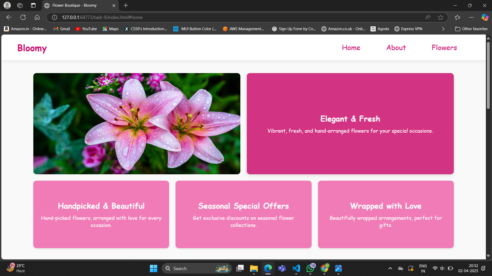

# Task 9 **Complex Responsive Layout with Grid and Flexbox**

## **Objective:**
- Design a sophisticated webpage layout that combines CSS Grid and Flexbox techniques.

## **Requirements:**
- Use CSS Grid to structure the main layout and Flexbox to handle the alignment and spacing of inner elements.
- Create overlapping elements (using `position` and `z-index`) and dynamic reordering based on viewport size.
- Implement a sticky header or sidebar that remains visible as the user scrolls.

## Implementation:
- Used `display: grid` for the overall structure in hero section.
- Applied `display: flex` for menus, cards, and content sections.
- Used `justify-content` and `align-items` for perfect spacing and alignment.
- Implemented `position: sticky` to keep navigation visible while scrolling.
- CCreated responsive `media queries` to dynamically rearrange elements and optimize the layout for different screen sizes.

## Outputs:

##### Hero section:

##### About section:

##### Products section:

